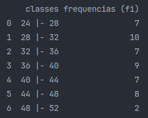

# Estatística com Python

Este repositório tem como finalidade, expor meu aprendizado de estatística para fixar o aprendizado e auxiliar aqueles que buscam este tipo de conteúdo.
Garanto atualizações nesse projeto conforme vou aprendendo mais desta área matemática, não só com códigos mas com explicações teóricas sobre o projeto.

Sobre a Estatística
-
Esta área da matemática, falando em tecnologia, é uma peça fundamental para quem trabalha com <b>Ciência Dados</b> e principalmente com <b>Inteligência Artificial</b>, visto
que com o uso desta ferramenta podemos perceber padrões e conseguir informações que sejam capazes de nos ajudar a <i>prever</i> futuros comportamentos de uma determinada
entrada de dados.

Para começar a trabalhar com o método estatístico, devemos separar cada etapa por partes a fim de uma melhor visualização e organização da solução.

Fases do Método Estatístico
-
- Definição do Problema;
- Planejamento;
- Coleta de Dados;
- Crítica dos Dados;
- Apuração dos Dados;
- Exposição dos Resultados;
- Análise dos Resultados.

<i>Obs.: Os resultados são expostos sempre em tabelas e / ou gráficos (nota-se a ênfase na visualização)</i>

Dados / Variáveis
-
Falando agora dos tipos de dados que podemos ter:
- Qualitativa ou Categórica (valores de atributo, como 'sexo', 'cor da pele', ...)
    - Nominal (quando o atributo não segue nenhuma ordem, como 'cor dos olhos', 'estado civil', ...)
    - Ordinal (quando o atributo segue uma ordem, como 'classe social', 'grau de instrução', ...)

- Quantitativas (valores expressos em números, como 'salário', 'idade', ...)
    - Discreta (quando o valor é oriundo de contagem, como 'número de candidatos', 'número de acidentes', ... (assemelha com o 'int'))
    - Contínua (quando o valor é oriundo de medição, como 'metros', 'peso', ... (assemelha com o 'float'))
---

    

---

 

Indo à Prática
-
Para uma operação estatística precisamos de uma tabela para ser usada como base e as amostras para serem utilizadas nos cálculos, normalmente representadas como <b>n</b>.

    

Nota-se que a tabela está imensa, seria muito mais organizada se separássemos por intervalos com um número de linhas menores (nº de classes). Por isso, vamos pegar o total
de amostras e tirar a raíz quadrada do mesmo, obtendo, desta maneira, o número de classes (representadas como <b>k</b>) ideal para a quantidade de amostras que temos no projeto <i>(arredonde para o inteiro
mais próximo caso dê um número decimal!)</i>.

<i>k = sqrt(n)</i>

Com isso, já temos o número de classes que serão utilizadas (as linhas da tabela), as idades (que serão o nosso foco de análise) e o número de amostras totais (que são a quantidade
de entradas que tem no vetor idade. Logicamente, se tratando de programação, teremos que ter muito mais etapas dentro do código, como a criação de <i>Series</i> e <i>DataFrames</i>.
Por isso recomendo que importe a biblioteca <b>pandas</b> no seu arquivo Python, é uma ótima ferramenta para aqueles que estudam <b>Ciência Dados</b> com esta linguagem.

Intervalos
-
Tenho certeza que você reparou que o número de linhas irá diminuir drasticamente (não sendo medido mais pelo <b>n</b> e sim pelo <b>k</b>. Portanto, para que isso funcione,
devemos ter uma coluna que representa um intervalo que seja capaz de se ajustar para caber exatamente no número de linhas definida pelo número de classes (isto é, ao invés de
analisarmos unitariamente (exemplo: a idade 24 aparece 2 vezes), iremos analisar através de intervalos entre os números(exemplo: as idades maiores e iguais a 24 e menores que 28,
aparecem 7 vezes).

Note no meu exemplo coloquei um intervalo de 4 números (entre 24 e 28), sabe o porquê disso?

Simples, existe um cálculo para encontrar este número de intervalo chamado <b>amplitude</b>, representado como <b>h</b> no meio estatístico.

<i>h = (x maximo - x minimo) / k</i>

Neste caso seria: <i>h = (idade max - idade min) / k</i>, desta maneira temos que a amplitude é igual a 4 (ou seja, ficaria assim: <i>24<=x<28; 28<=x<32; ...</i>)

<i>Obs.: Importante!! Nesta divisão, o número decimal deve ser arredondado para o maior inteiro. Isto é, se a divisão der 3,22, deve ser arredondado para 4 ao invés de 3.</i>

Com isso, sua tabela deve estar assim (supondo que esteja utilizando a mesma base de dados):

    

    

Ponto Médio de Classes
-
Caso necessite do Ponto Médio entre os números de cada linha, será necessário apenas fazer o cálculo básico da média.

Utilizando nosso exepmlo acima, se quisermos o ponto médio da primeira classe, então é só fazer <i>xi = (24 + 28) / 2</i>, o valor será 26.

Assim, visualmente deverá ser:

    

    

 

## Projeto em Andamento...
